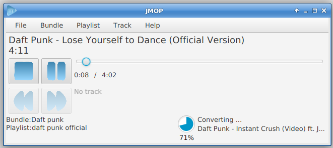
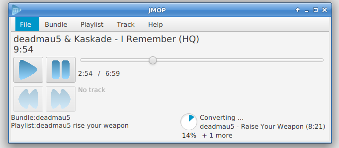

# JMOP

  

JMOP is Java-based music player working both online and offline.

# What?

JMOP holds its own collection of music. This music is beeing played from some source (well, currently only Youtube is supported). Each (music) video is at first play downloaded and converted into MP3. At the later play it is played from the disk. This saves your bandwidth (or even allows you to listen your favourite music when you don't have access to internet) and also creates simple audioteque at your local computer.
  
# Screenshots
 
 
 
# Download
See GitHub [Releases](https://github.com/martlin2cz/jmop/releases ) site to get the latest version or take look into `releases` folder in the project root. 

# Help
The JMOP user help files (in english and czech) can be found inside of the `/jmop/src/main/resources/cz/martlin/jmop/gui/help` directory. See them online: [czech](https://github.com/martlin2cz/jmop/blob/master/jmop/src/main/resources/cz/martlin/jmop/gui/help/help_cs.html), [english](https://github.com/martlin2cz/jmop/blob/master/jmop/src/main/resources/cz/martlin/jmop/gui/help/help_en.html). 

The same help is accesible from the app by menu item _Help_ or by pressing _F1_.

# Build from sources
To build JMOP from sources, use maven. For instance `mvn clean install`. Then run as usual.

You can modify JMOP behaviour quite a lot by changing line `BaseJMOPBuilder builder = new DefaultJMOPPlayerBuilder();` in `JMOPGUIApp` class. JMOP builder generates the core object, take a look to its default implementation. You can modify and provide updated to the builder any part of the application core.

# TODO
 - [ ] add more sources (Soundcloud for instance)
 - [ ] add dynamic search and autocomplete
 - [ ] add more proper configuration check
 - [ ] avoid using youtube-dl and ffmpeg
 - [ ] allow to import playlists
 - [ ] add nogui mode (play from console)
 - [ ] add RMI/client-server support
 - [ ] fix various bugs