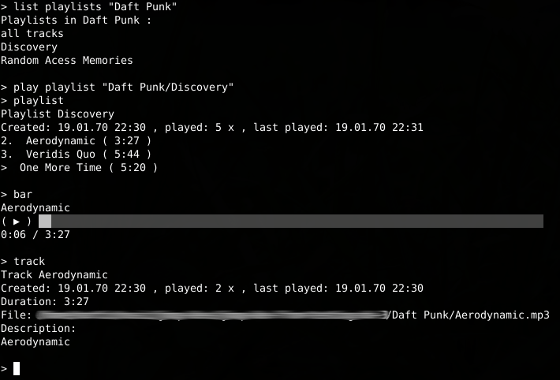

# JMOP

  

JMOP is very simple (console-based) Java based music player. You can see it as an acronym of "Java music _only_ player". And that's mostly everything you should know about.

# But...?

Apart from the usual music players, JMOP can play **only and only** what's located in its _musicbase_. It's like a very simple library of your music. (It's just directory in specific format.)

The main idea of JMOP is to play music you have locally on your computer, not beeing annoyed by some extra GUI window. The music shall just flow, and you may not have to even bee thinking about any music player been running.

And why just command-line app? Well, It's a hobby project and mantaining good and user-friendly GUI is extremelly time-consuming. If you want to see _bad_ UX, try the version 1.

# Screenshots
 
 
# How to start
1. Dedicate folder for your musicbase.
2. Start jmop by running
````
$ cd dist
$ ./jmop-player.jar /your/favourite/music/folder
````
3. If everything goes well, you can start building your own musicbase, like:
````
> create bundle Ventolin
> create track Ventolin "Disco Science" duration=3:19 set-file=/music/ventolin/disco-science.mp3
> create playlist best-of-ventolin bundle=Ventolin
> playlist Ventolin/best-of-ventolin add "Ventolin/Disco science"
````
4. And then play:
````
> play playlist Ventolin/best-of-ventolin
> pause
> next
> stop
````
5. If that's too anoying for you, you can use sourcery to import your music, various ways, like:
````
$ ./jmop-sourcery.sh --musicbase= /your/music/dir import-tracks-from-files  --create-bundle MidiLidi ~/music/midilidi/
$ ./jmop-sourcery.sh --musicbase= /your/music/dir import-playlist-from-file --bundle MidiLidi ~/music/midilidi/OperaceKindigo.xspf
````

# Getting help
In any cases, typing `help` may display your options, like:
````
> create track help
Usage: jmop-cli create track [description=<description>] duration=<duration>
	(...)

> play help
Usage: jmop-cli play [TRACK_INDEX] [COMMAND]
Starts the playing of the specified bundle, playlist or track
      [TRACK_INDEX]   Plays directly the track of the current playlist
	(...)

$ ./jmop-sourcery.sh -mb=~/Hudba/jmop-devs/testing-with-sourcery import-tracks-from-playlist  help
Usage: sourcery import-tracks-from-playlist [-f=<createFiles>]
	(...)
```

# Download
See GitHub [](https://github.com/martlin2cz/jmop/releases "Releases") site to get the latest version. **Important note:** The project is still under development, expected less-then-more stable releases. Rather checkout the latest version and build from sources.

# Build from sources
To build JMOP from sources, use _Apache maven_. Naviage to `jmop-player-cli` module and build. For instance `mvn clean package`. Then run as usual, `mvn exec:java` for instance.

To prepare executable binaries, run the `./do-the-release.sh`. It will output the ZIP containing all the nescessary files, so with the Windows BAT and unix Bash scripts to run the JMOP.

# Requirements
- any Windows/Unix (and possibly Mac too, but didn't tried)
- Java > 11

# History
## Version 1
Initial testing and prototyped version, with ugly GUI.

## Versions 1.*
Some fixes in the version 1, still ugly GUI.

## Version 2 (not completed)
Giant reimplementation almost from scratch (advanced amazing GUI planned). Did not get finished though.

## Version 3 (version 3.1.* actually)
Base of version 2 but trimmed of lot of features, including the GUI replacement by interactive TUI/REPL/shell. Sourcery separated to be independend component (for the case someone would complain of music copyright reasons).


